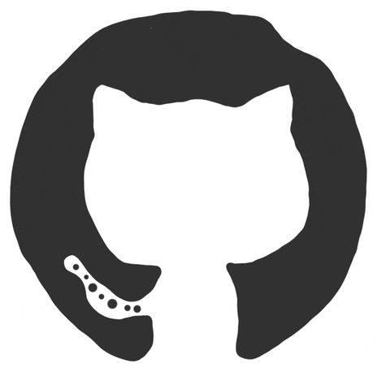

<h3 align="center">Name of Repo Placement</h3>

<em>Just a quick description of the Repo's purposes. Replace the octocat image above for the Repo Introduction/Banner/Video/Screenshot</em>

<strong>You like the Repo? Don't forget to 🌟, 👁️, 🔱 and ❤️!</strong>

  
  
  
  
  
  
  
  
  
  
  
  

## 

First off, thank you for taking the time to contribute! The following is a set of guidelines to help you contribute to this project. These are mostly suggestions to maintain the project’s quality and ensure a smooth collaboration. Please note that this project is governed by a [Code of Conduct](CODE_OF_CONDUCT.md). By participating, you are expected to uphold this code.

There are several ways to contribute to this project, at least the basics are:

- Please do `Star`, `Watch` and `Fork` this repo? Or, maybe ❤️ by:
  
   

<!-- Make sure your request is meaningful and you have tested the app locally before submitting a pull request. -->

## 

If you find a bug or issue in the project, please follow these steps:
- **Check for duplicates** : Review the [open](https://github.com/thenocturnaldevgypsy/REPONAME/issues?q=is%3Aopen+is%3Aissue) and [closed](https://github.com/thenocturnaldevgypsy/REPONAME/issues?q=is%3Aissue+is%3Aclosed) issue tickets, as well as the 💡 [Ideas + Community Vote!](https://github.com/thenocturnaldevgypsy/REPONAME/discussions/categories/ideas-community-vote) and 💬 [Q & A](https://github.com/thenocturnaldevgypsy/REPONAME/discussions/categories/q-a) sections in the discussions tab, to ensure the bug hasn't already been reported.
- **Submit an issue ticket** : If the bug hasn't been reported, create a [new issue](https://github.com/thenocturnaldevgypsy/REPONAME/issues/new) ticket with the label "**bug**" and include the following details to help us understand and resolve the issue:
   - **Steps to reproduce** : Provide clear and detailed steps to replicate the problem.
   - **Environment details** : Mention your OS, browser, or any other relevant environment specifics.
   - **Screenshots or code snippets** : Attach any visual aids or code snippets if applicable.
   - **Test case reference (if available)** : Share a link to a relevant test case that demonstrates the bug.
   - **Indicate if you’re willing to contribute to fixing the bug.**

## 

We encourage suggestions for new features that can improve the project! Make sure your request is meaningful. Here’s how you can contribute:
- **Check for duplicates** : Before submitting a request, review the [open](https://github.com/thenocturnaldevgypsy/REPONAME/issues?q=is%3Aopen+is%3Aissue) and [closed](https://github.com/thenocturnaldevgypsy/REPONAME/issues?q=is%3Aissue+is%3Aclosed) issue tickets and the 💡 [Ideas + Community Vote!](https://github.com/thenocturnaldevgypsy/REPONAME/discussions/categories/ideas-community-vote) and 💬 [Q & A](https://github.com/thenocturnaldevgypsy/REPONAME/discussions/categories/q-a) sections in the discussions tab.
- **Submit your idea** : If your idea hasn’t been proposed, post it in the 💡 [Ideas + Community Vote!](https://github.com/thenocturnaldevgypsy/REPONAME/discussions/new?category=ideas-community-vote) discussion section.
   - Provide a clear and concise explanation, including:
      - Why the feature is needed: Explain the problem it solves or the value it adds for users.
      - Visual aids (optional) : Share mockups, flowcharts, or any other material to help visualize your idea.
   - **Community prioritization** : Features will be prioritized based on community feedback. Ideas with at least 10 "Yes/I support" votes will be considered for implementation.

## 

Improving documentation is a valuable way to contribute! By contributing to the documentation, you’ll help improve the project’s accessibility and usability for all users! Here’s how you can help:
- **Check for duplicates** : Review the [open](https://github.com/thenocturnaldevgypsy/REPONAME/issues?q=is%3Aopen+is%3Aissue) and [closed](https://github.com/thenocturnaldevgypsy/REPONAME/issues?q=is%3Aissue+is%3Aclosed) issue tickets, as well as the 💡 [Ideas + Community Vote!](https://github.com/thenocturnaldevgypsy/REPONAME/discussions/categories/ideas-community-vote) and 💬 [Q & A](https://github.com/thenocturnaldevgypsy/REPONAME/discussions/categories/q-a) sections in the discussions tab, to ensure the suggestion or correction hasn’t already been submitted.
- **Submit your documentation changes** : You can propose your documentation updates in two ways:
   - Post in 💡 [Ideas + Community Vote!](https://github.com/thenocturnaldevgypsy/REPONAME/discussions/new?category=ideas-community-vote) : Share your ideas or corrections in the discussions tab to gather feedback and suggestions from others.
   - Submit a [pull request (PR)](https://github.com/thenocturnaldevgypsy/REPONAME/compare) : Make the necessary changes directly to the code and submit a PR with the label "docs".
- **Review process** :
   - The author and maintainers will review all suggestions and make the necessary adjustments based on their judgment.
   - Unlike feature requests, documentation updates will not be subject to community voting. Decisions will rely solely on the maintainers’ perspective.

## 

Contributing code is an excellent way to enhance the project! Follow these steps to ensure a smooth process:
- Choose what to work on:
   - **Feature Contributions** : Pick a feature idea from the 💡 [Ideas + Community Vote!](https://github.com/thenocturnaldevgypsy/REPONAME/discussions/categories/ideas-community-vote) section from discussions that has:
      - At least 10 upvotes from the community.
      - A recommendation from the author or maintainers.
   - **Bug Fixes** : Work on bugs that have been submitted as [issue tickets](https://github.com/thenocturnaldevgypsy/REPONAME/issues) and verified by the author or maintainers.
- **Check for duplicates** : Ensure the issue or feature hasn’t already been addressed by reviewing:
   - [Open](https://github.com/thenocturnaldevgypsy/REPONAME/issues?q=is%3Aopen+is%3Aissue) and [closed](https://github.com/thenocturnaldevgypsy/REPONAME/issues?q=is%3Aissue+is%3Aclosed) issue tickets.
   - The 💡 [Ideas + Community Vote!](https://github.com/thenocturnaldevgypsy/REPONAME/discussions/categories/ideas-community-vote) and 💬 [Q & A](https://github.com/thenocturnaldevgypsy/REPONAME/discussions/categories/q-a) sections in the discussions tab.
- Prepare your workspace:
   - **[Fork the repository](https://github.com/thenocturnaldevgypsy/REPONAME/fork)** : Create a copy of the repo under your account.
   - **Clone the repo locally** : Work on the code on your local machine.
- Create a new branch:
   - Use the following naming convention for your branch:
   `updatetypekeyword-GitHubUserName-shortdescription`
   - List of `updatetypekeyword` values:
      - `feat` : A new feature
      - `fix` : A bug fix
      - `docs` : Documentation only changes
      - `style` : Changes that do not affect the meaning of the code (white-space, formatting, missing semi-colons, etc)
      - `refactor` : A code change that neither fixes a bug nor adds a feature
      - `perf` : A code change that improves performance
      - `test` : Adding missing tests or correcting existing tests
      - `build` : Changes that affect the build system or external dependencies (example scopes: gulp, broccoli, npm, yarn)
      - `ci` : Changes to our CI configuration files and scripts (example scopes: Travis, Circle, BrowserStack, SauceLabs)
      - `chore` : Other changes that don’t modify src or test files
      - `revert` : Reverts a previous commit
   - Examples: `feat-thenocturnaldevgyps-dark-mode-toggle`
- Make sure your code follows the guidelines from 📚 [Coding / Development Standards](https://github.com/thenocturnaldevgypsy/REPONAME/discussions/categories/coding-development-standards) from discussions section. Use consistent naming and formatting conventions. Follow the coding style already present in the repository. Document functions and methods where necessary.
- **Submit your pull request (PR)** :
   - Add a detailed log of what changes were made in your PR. Do your best to fill out each field, preferably in as much detail as possible.
   - Use the appropriate label (matching the updatetypekeyword from your branch) for backtracking purposes.
   - Make sure you have tested the app locally before submitting a pull request. If you can add test cases and references, it would be nice.
   - Assign the author ([Abegail Torrendon / thenocturnaldevgypsy](https://github.com/thenocturnaldevgypsy-io)) or maintainers to review your PR.

By following this structured approach, your contributions can be reviewed and merged efficiently. Thank you for helping make this project better!

## 

 If you have any questions, you can contact the maintainers in this project's [discussions](https://github.com/thenocturnaldevgypsy/REPONAME/discussions) section.
- 📣 [Announcements & Updates](https://github.com/thenocturnaldevgypsy/REPONAME/discussions/categories/announcements-updates) : Announcements, updates and roadmaps from maintainers.
- 📚 [Coding / Development Standards](https://github.com/thenocturnaldevgypsy/REPONAME/discussions/categories/coding-development-standards) : Coding and Development Standards guidelines for the contributors and maintainers.
- 💡 [Ideas + Community Vote!](https://github.com/thenocturnaldevgypsy/REPONAME/discussions/categories/ideas-community-vote) : Share ideas for new features and let the community vote for it!
- 🎉 [IN ACTION! Show and Tell!](https://github.com/thenocturnaldevgypsy/REPONAME/discussions/categories/in-action-show-and-tell) : If you have a particularly cool way of using this project/repo, show it off by sharing it here!
- 💬 [Q & A](https://github.com/thenocturnaldevgypsy/REPONAME/discussions/categories/q-a) :  Ask the maintainers about... anything you want. Ask questions. Receive answers.

Also, feel free to contact me (author) by [creating a new discussion](https://github.com/thenocturnaldevgypsy/thenocturnaldevgypsy/discussions/new?category=ask-me-anything-ama-and-q-a) at **💬 Ask Me Anything! (AMA and Q&A)** category under my GitHub Profile Repo's Discussions.

 
<!-- ## 

- 🐞 Bug Fixing : Contributors can help by reviewing and confirming reported issues. This includes submitting a report, verifying and providing additional details.

- 💡 Feature Requests: Contribute your innovative ideas to enhance my project's functionality by suggesting new features.

- 📝 Documentation Updates: Help me improve user experience and clarity by contributing to the documentation section with updates, clarifications, or additional information.

- ✨Code Contributions : Contributors can enhance the project by implementing new features or improvements suggested by users. Unfortunately, I will move this one to hiatus first, as I need to make arrangement with reviewing those in the future.

## 

- Drop a Star ⭐ and 👁️ in this repo
- Take a look at the existing [open](https://github.com/thenocturnaldevgypsy-io/REPO-NAME/issues?q=is%3Aopen+is%3Aissue) and [closed](https://github.com/thenocturnaldevgypsy-io/REPO-NAME/issues?q=is%3Aissue+is%3Aclosed) issues for possible duplicates.
- If there is no open issue for your problem/request, submit a new issue, and please make sure to choose the right labels:
   - `feat` : A new feature
   - `fix` : A bug fix
   - `docs` : Documentation only changes
   - `style` : Changes that do not affect the meaning of the code (white-space, formatting, missing semi-colons, etc)
   - `refactor` : A code change that neither fixes a bug nor adds a feature
   - `perf` : A code change that improves performance
   - `test` : Adding missing tests or correcting existing tests
   - `build` : Changes that affect the build system or external dependencies (example scopes: gulp, broccoli, npm, yarn)
   - `ci` : Changes to our CI configuration files and scripts (example scopes: Travis, Circle, BrowserStack, SauceLabs)
   - `chore` : Other changes that don’t modify src or test files
   - `revert` : Reverts a previous commit
   
   Do your best to fill out each field, preferably in as much detail as possible.
- Assign the ticket to me ([Abegail Torrendon / thenocturnaldevgypsy](https://github.com/thenocturnaldevgypsy-io)) so I can review and I'll work on it (or maybe we can collab!). -->